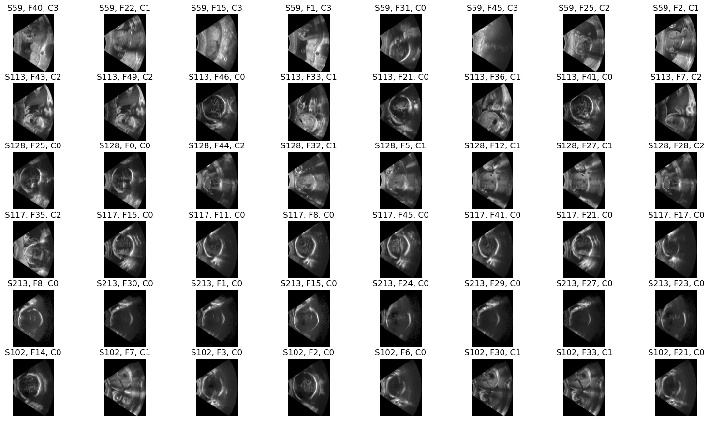

# Classification

This tutorial implements a multi-class classification algorithm to classify 2D fetal ultrasound images that contain fetus head, abdomen, heart or other views.




Use the module [development environments](../../docs/env.md) to run the code, with the tutorial folder as the current directory.

## TensorFlow
```bash
micromamba activate mphy0041-tf  
python data.py  # download data
python visualise.py  # save example images in visualise.jpg  
python tf_train.py
```

## PyTorch
```bash
micromamba activate mphy0041-pt  
python data.py  # download data
python visualise.py  # save example images in visualise.jpg  
python pt_train.py
```
