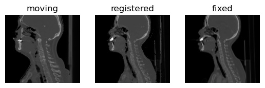

# Registration

This tutorial implements unsupervised registration networks for 2D head-and-neck CT images.  




## TensorFlow 2 examples
The tutorial uses code adapted from [Tensorflow Examples](https://github.com/tensorflow/examples), please install first in the `mphy0041` conda environment:
```
pip install -q git+https://github.com/tensorflow/examples.git
```

## Other materials
A series tutorials for image registration can be found in the [Learn2Reg tutorial](https://github.com/learn2reg/tutorials2019). 

For 3D medical image registration using deep learning, see the [DeepReg](http://deepreg.net) package at [GitHub](https://github.com/DeepRegNet/DeepReg). 

The local folder [legacy](./legacy) contains a 2d version using TensorFlow 1.
