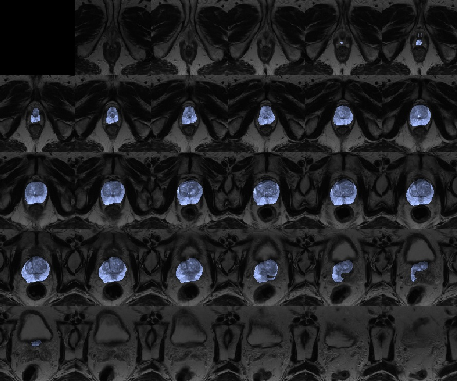

# Segmentation

This tutorial implements a U-Net variant for segmenting prostate gland from 3D MR images, collected from [the PROMISE12 challenge](https://promise12.grand-challenge.org/).  



Use the module [development environments](../../docs/env.md) to run the code, with the tutorial folder as the current directory.

## PyTorch
```bash
micromamba activate mphy0041-pt  
python data.py  # download data
python pt_train.py
python visualise.py  # save plotted results  
```

## TensorFlow
>This is an example of low-level TensorFlow implementation.
```bash
micromamba activate mphy0041-tf 
python data.py  # download data
python tf_train.py
python visualise.py  # save plotted results  
```
