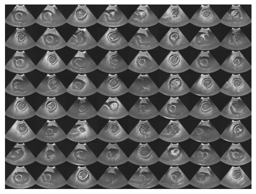
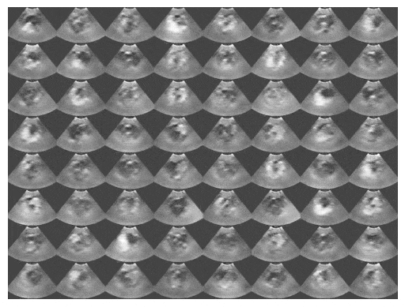

# Synthesis

This totualrial demonstrates an algorithm of ultrasound image simulation using generative adversarial networks (GANs), using a data set described in [a published research paper](https://arxiv.org/ftp/arxiv/papers/1707/1707.05392.pdf). The [deep convolutional generative adversarial networks (DCGAN)](https://arxiv.org/pdf/1511.06434.pdf) is implemented in TensorFlow and PyTorch.  



The following animates the randomly sampled simulations from 1st to 75th ephoch.  




Use the module [development environments](../../docs/env.md) to run the code, with the tutorial folder as the current directory.

## PyTorch
```bash
micromamba activate mphy0041-pt  
python data.py  # download data
python pt_train.py
python visualise.py  # save plotted results  
```

## TensorFlow
```bash
micromamba activate mphy0041-tf 
python data.py  # download data
python tf_train.py
python visualise.py  # save plotted results  
```
